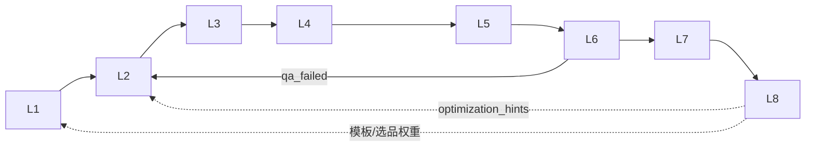

# 架构逻辑说明 — 控制面 / 渲染面 / 八层管线

> **用途**：后期联调与生产开发时的**唯一逻辑约束文档**。  
> **配套**：[MASTER_PLAN.md](./MASTER_PLAN.md)（索引与排期）、[TECH_STACK.md](./TECH_STACK.md)（Vercel 技术栈）、[TOOLING.md](./TOOLING.md)（工具映射）。

---

> **与视频后期的区别**：本文描述 **SaaS 工程架构**（控制面/渲染面/八层 L1–L8），**不是**镜头粗剪、C4D Hero、AE 合成等**视频后期制作**流程。后者见 **[POST_PRODUCTION_LOGIC.md](./POST_PRODUCTION_LOGIC.md)**。


## 1. 阶段划分：什么在哪里跑

| 阶段 | 时间盒 | 控制面 | 编排执行 | 渲染面 | 数据闭环 |
|------|--------|--------|----------|--------|----------|
| **脚手架期** | W1 | `apps/web` 本地 `:3000` | 本地 FastAPI `:8765` 顺序跑 L1–L8 stub | 可选本地 `video-factory` / C4D | 无持久化，内存 artifacts |
| **联调期** | W2–W4 | Vercel Preview + Clerk | FastAPI **或** Vercel Workflow 下发 Worker | Railway / 本地 i9 Worker + Webhook 回写 | Postgres job 行 + Blob 产物 URL |
| **生产期** | W5–W6 | Vercel Production | **Vercel Workflow 为主**；FastAPI 仅 dev/Worker 侧 | 专用渲染节点（禁止 Vercel 内跑 C4D/FFmpeg） | L8 写 Postgres → 反馈 L1/L2 模板库 |

### 1.1 三个「平面」不要混

```
商家 / Cursor Agent
        │ HTTP / MCP（开发工具入口，非生产调度）
        ▼
┌─────────────────────────────────────┐
│ 控制面 · Vercel (apps/web)          │  Dashboard、鉴权、AI Gateway、Workflow 定义
│ Next.js 15 · Clerk · Postgres/KV/Blob│
└──────────────┬──────────────────────┘
               │ POST /api/pipeline/run（脚手架：proxy）
               │ 生产：Workflow step → 队列 / Webhook
               ▼
┌─────────────────────────────────────┐
│ 编排面 · 本地 FastAPI (脚手架)       │  L1–L8 Layer Registry + Adapters
│ 或 Vercel Workflow (生产)            │  状态机、重试策略、层间校验
└──────────────┬──────────────────────┘
               │ 仅 L4/L3 触发重任务
               ▼
┌─────────────────────────────────────┐
│ 渲染面 · Worker (video-factory/C4D) │  长耗时、GPU、Commandline.exe
└─────────────────────────────────────┘
```

**关键结论**：

- **Vercel = 控制面**：不接 C4D Commandline、不跑分钟级 FFmpeg。
- **FastAPI orchestrator = 脚手架期联调入口**；生产期由 **Workflow + Worker Webhook** 替代其「调度」职责，层逻辑可复用 `orchestrator/layers/`。
- **OpenClaw / Cursor / Cline MCP** 是**开发者工具链**，可调用 orchestrator HTTP；**不是**生产环境 Job Scheduler（L5 生产由 Vercel Workflow 承担）。

---

## 2. 层间依赖 DAG（L1→L8）

严格顺序：**L1 → L2 → L3 → L4 → L5 → L6 → L7 → L8**。  
请求中的 `layers` 必须是上述序列的**有序子序列**（不可跳前层、不可乱序）。

| 层 | 输入依赖 | 输出 artifacts | 可并行部分 |
|----|----------|----------------|------------|
| L1 爬虫 | `product_url` | `crawled_url` | — |
| L2 脚本 | L1 商品信息 | `script` | — |
| L3 分镜 | L2 脚本 | `storyboard_yaml` | — |
| L4 渲染 | L3 分镜 | `video_factory_output`, `c4d_output` | **同层内** video-factory 与 C4D 可并行 |
| L5 调度 | L4 产物 | `scheduled_job` | 生产：入队 KV/Workflow，不等渲染完成 |
| L6 质检 | L4/L5 产物 | `qa_score` | RAG 检索与规则打分可并行 |
| L7 发布 | L6 通过 | `publish_url` | 多平台 adapter 可并行 |
| L8 数据 | L7 发布结果 | `metrics_recorded`, `optimization_hints` | 聚合写库 |



---

## 3. Job 状态机

| 状态 | 含义 | 进入条件 |
|------|------|----------|
| `pending` | 已创建未执行 | 收到 pipeline 请求 |
| `running` | 层循环中 | 开始执行 L1 或重试段 |
| `l4_render` | 渲染阶段 | 进入 L4（长耗时，可单独展示进度） |
| `qa_failed` | 质检未通过 | L6 `status=error` 或 `qa_score < 0.7` |
| `published` | 已发布 | L7 成功 |
| `analyzed` | 已分析 | L8 完成 |
| `error` | 非 QA 的硬错误 | L1–L5/L7 失败或未知层错误 |

状态迁移（简图）：

```
pending -> running -> l4_render -> running -> ... -> published -> analyzed
                              \-> qa_failed (retry_from: L2)
                              \-> error
```

---

## 4. 失败回流与数据闭环

### 4.1 L6 QA 失败 → 从 L2 重跑

- **原因**：脚本/口播问题是种草视频失败的主因；L3 分镜与 L4 渲染依赖 L2。
- **响应字段**：`retry_from: "L2"`，`pipeline_state: "qa_failed"`。
- **生产实现**：Workflow 创建子 Job，从 L2 起执行 `[L2,L3,L4,L5,L6,L7,L8]`，保留 L1 artifacts。

### 4.2 L8 → L1/L2 闭环（demo / 生产目标）

L8 stub 输出 `optimization_hints`，示例：

- 提高前 3 秒 hook 强度 → 反馈 **L2 脚本模板**
- 缩短口播句长 → **L2**
- 增加产品特写 → **L3 分镜模板**
- 低效 SKU 降权 → **L1 选品策略**

生产期：hints 写入 Postgres `optimization_events`，异步更新模板库与 A/B 权重。

---

## 5. 环境矩阵

| 能力 | local dev | Vercel preview | production |
|------|-----------|----------------|------------|
| Dashboard | `npm run dev:web` | Preview URL | 正式域名 |
| `POST /api/pipeline/run` | Proxy -> `:8765` | 同左或 Workflow | **Workflow 触发**，非同步 8 层 HTTP |
| FastAPI orchestrator | **必须**（联调） | 可选隧道/Railway | **不对外暴露**；Worker 内可 import layers |
| C4D / video-factory | 本地路径 | Worker 节点 | 专用渲染 Worker |
| Postgres / Blob | 可选本地 Docker | Neon Preview | Neon Prod |
| Clerk 鉴权 | 可关 | Preview keys | Prod keys |

环境变量：`ORCHESTRATOR_URL` 仅脚手架 proxy 使用；生产以 `DATABASE_URL`、Workflow 配置为准。

---

## 6. 禁止事项（后期开发必读）

| 禁止 | 原因 | 正确做法 |
|------|------|----------|
| 在 Vercel Serverless 内调用 C4D Commandline | 超时、无 GUI/许可证环境 | L4 下发 Worker，Webhook 回写 |
| 在 Vercel 内跑完整 L4 FFmpeg 管线 | `maxDuration` 与内存限制 | video-factory Worker |
| 用 OpenClaw 作生产 Job Scheduler | Agent 非 SLA 编排器 | L5 = Vercel Workflow |
| 跳过层顺序（如直接 L4 无 L3） | 分镜缺失导致渲染不可控 | `validate_layer_order()` |
| Dashboard 同步等待 8 层跑完（生产） | 渲染分钟~小时级 | 异步 Job + 轮询/SSE 状态 |
| 把 MCP 当唯一 API | MCP 面向 IDE | 商家走 HTTPS API + 鉴权 |

---

## 7. 后期开发顺序（W2–W6）与前置依赖

| 周 | 目标 | 前置 | 交付物 |
|----|------|------|--------|
| **W2** | L1–L3 实装 + Gateway 脚本 | Clerk、Postgres schema、LAYER_ORDER 校验 | 真实 crawl + `streamText` 脚本 + YAML 分镜 |
| **W3** | Workflow + L4 Worker | W2 稳定 artifacts 契约 | 队列 Job、`/api/webhooks/render`、状态 `l4_render` |
| **W4** | L6 RAG + L7 发布 + Blob | W3 Webhook、pgvector | `qa_failed` 重试、`published` |
| **W5** | L8 分析 + 闭环 MVP | W4 发布 metrics | `optimization_hints` 入库、L2 模板只读 API |
| **W6** | Preview 端到端 Demo | W1–W5 | 租户隔离、监控、文档验收 |

**逻辑前置链**：鉴权/DB -> L1–L3 内容契约 -> Worker/Webhook -> QA 回流 -> L8 闭环。

---

## 8. 与代码的对应关系

| 概念 | 代码位置 |
|------|----------|
| 层注册表 | `orchestrator/layers/__init__.py` |
| 状态枚举 / 层序 | `orchestrator/pipeline_state.py` |
| 顺序执行 + QA 回流 | `orchestrator/main.py` `POST /pipeline/run` |
| Web 控制面 proxy | `apps/web/src/app/api/pipeline/run/route.ts` |
| L6 阈值 | `QA_PASS_THRESHOLD`（默认 0.7） |
| L8 hints | `orchestrator/layers/l8_data.py` -> 响应 `optimization_hints` |

---

## 9. 脚手架 vs 生产：一次请求的两条路径

**脚手架（当前）**：

```
Dashboard -> POST /api/pipeline/run -> FastAPI /pipeline/run -> 同步 for-loop L1-L8
```

**生产（目标）**：

```
Dashboard -> Server Action 创建 Job (pending)
         -> Vercel Workflow
              -> steps L1-L3 on Vercel
              -> enqueue L4 on Worker (state: l4_render)
              -> Webhook resume L5-L8
         -> Dashboard SSE 订阅 job 状态
```

同一套 **层接口（LayerContext / LayerResult）** 两种调度器共用，避免业务逻辑分叉。
