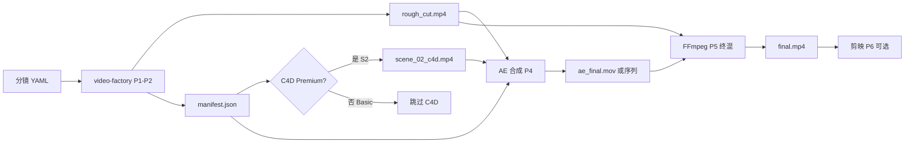
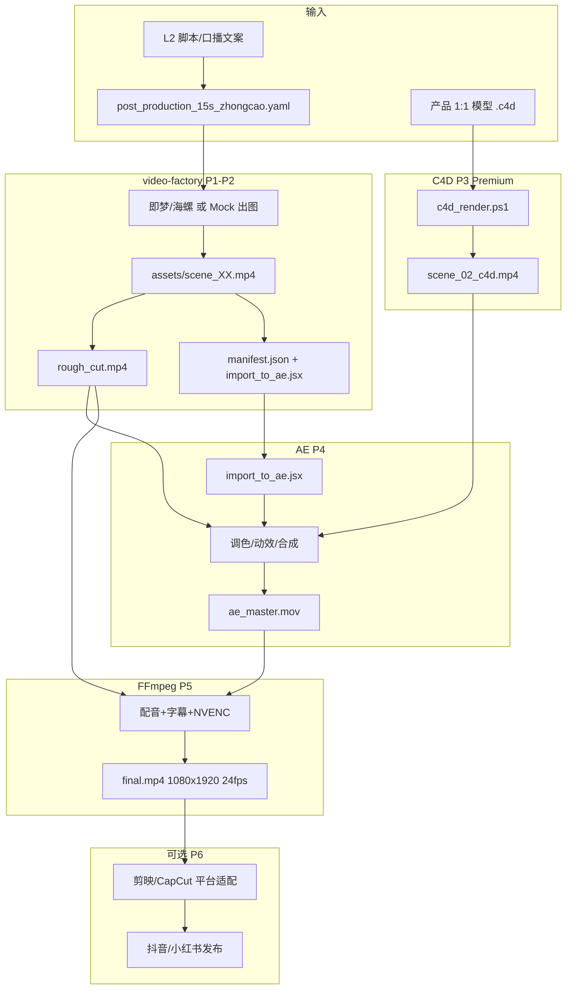

# 视频后期制作工作流逻辑

> **版本**：v1.0 · **仓库**：`ai-video-orchestrator` + `video-factory`  
> **定位**：15 秒竖屏种草视频的**后期制作**（Post-Production）规范——从 AI/C4D 素材到成片  
> **环境**：i9 + RTX 3050 · C4D R23（`C:\BKC4D`）· FFmpeg（`C:\Users\oyxw\bin\ffmpeg`）· AE **待安装**

---

## 文档说明

本文描述的是**视频后期制作**（粗剪、合成、调色、字幕、3D 替换、平台导出），**不是**软件项目的开发阶段或八层 SaaS 架构排期。后者见 [MASTER_PLAN.md](./MASTER_PLAN.md)、[TOOLING.md](./TOOLING.md)。

若此前误将「架构逻辑」理解为工程里程碑，请以本文的四段式镜头管线为准。

---

## 1. 后期制作全流程（从 AI 素材到成片）

### 1.1 输入物（Input）

| 类型 | 来源 | 说明 |
|------|------|------|
| AI 视频/静图片段 | 即梦 / 海螺 / ComfyUI / video-factory mock | 全景钩子、口播 B-roll、占位产品图 |
| C4D 渲染序列 | `scripts/c4d_render.ps1` | **仅 S2 产品特写**（Premium 档） |
| 配音 | ai-koubo / 剪映 TTS / 人工录制 | 口播段（9–13s）对齐 |
| 字幕 | `subtitles.srt` 或 AE 文字层 | 卖点堆叠、CTA |
| 分镜元数据 | `manifest.json` | 时间轴、镜头 Brief、交接字段 |

### 1.2 处理阶段（顺序不可颠倒）

```
P0 分镜 YAML          L3 / video-factory demos
    ↓
P1 素材生成           AI 出图/出视频 + Ken Burns 粗 clip
    ↓
P2 FFmpeg 粗剪        concat + crossfade → rough_cut.mp4
    ↓
P3 C4D 产品 Hero      仅替换 S2（Premium）→ scene_02_c4d.mp4
    ↓
P4 AE 精修合成        调色、动效、多层合成、品牌收尾（CPU）
    ↓
P5 FFmpeg 终混        配音对齐、字幕烧录、规格归一 → final.mp4
    ↓
P6 平台适配（可选）   剪映/CapCut 加贴纸、多比例、发布预设
```

### 1.3 输出规格（Output）

| 项 | 值 |
|----|-----|
| 分辨率 | **1080 × 1920**（9:16） |
| 帧率 | **24 fps**（交付标准；video-factory 默认 30 fps 时终混用 FFmpeg `-r 24` 归一） |
| 编码 | **H.264**（本机优先 `h264_nvenc`，3050 硬件编码） |
| 时长 | **15.0 s**（四段式，见 §3） |
| 容器 | MP4 · yuv420p |

**成片路径**：`video-factory/output/<slug>/<timestamp>/final.mp4` → 上传 Vercel Blob / 剪映导入。

---

## 2. 工具分工逻辑（何时用哪个工具）

### 2.1 FFmpeg — 粗剪与交付引擎

**职责**：时间线拼接、转场、静图 Ken Burns、字幕烧录、帧率/编码归一、Proxy 生成。

**何时用**：
- P2：多段 clip → `rough_cut.mp4`（`ffmpeg_util.concat_clips`）
- P5：配音混流、SRT 烧录、24fps + H.264 终输出（`burn_subtitles` / `video_encode_args`）
- 夜间批处理：批量重编码、生成低码率 Proxy 供 AE 预览

**为何不用 AE 做粗剪**：AE 启动慢、不适合批量 concat；FFmpeg 秒级完成 15s 时间线。

### 2.2 Cinema 4D — 产品 3D 特写 ONLY

**职责**：1:1 产品模型 Hero 镜头（旋转、材质、棚拍光）。

**何时用**：
- **仅 S2（4–9s 产品特写）**，Premium 档
- Basic 档：即梦/海螺 AI 视频直接替代，不走 C4D

**为何限制范围**：
- RTX 3050 **VRAM ~8GB**，全场景 + 高分辨率易 OOM
- C4D Commandline **CPU 渲染**为主（本环境未依赖 Redshift/Octane GPU 全流程）
- 一条 15s 种草只需 **5s 产品 Hero**，ROI 最高

**入口**：`C:\BKC4D\Commandline.exe` 或 `video-factory/scripts/c4d_render.ps1`

### 2.3 After Effects — 动效、调色、多层合成

**职责**：全景钩子动效、口播包装、LUT 调色、品牌 Logo 收尾、精细字幕动画。

**何时用**：
- S1 全景：AI 素材 + 动效/调色
- S3 口播：口播条、卖点字幕、波形装饰
- S4 品牌：Logo 定版、CTA 动画
- **合成 C4D 序列**：将 `scene_02_c4d.mp4` 嵌入时间线

**运行方式**：**本机 CPU**（`aerender -cpu`）；3050 不参与 AE 渲染。

**当前状态**：AE **未安装**（W5 计划）。过渡期可用 FFmpeg + 剪映完成 Basic 档交付。

### 2.4 剪映 / CapCut — 最终平台适配（可选）

**职责**：抖音/小红书发布预设、AI 配音、贴纸、封面、多比例裁切。

**何时用**：P6，已有 `final.mp4` 后的**运营层**微调，不替代 P4 工业化合成。

---

## 3. 镜头–工具映射表（15s 四段式）

| 段 | 时间 | 镜头内容 | Basic 档 | Premium 档 | 主工具 |
|----|------|----------|----------|------------|--------|
| **S1** | 0–4s | 全景 / 痛点钩子 | 即梦/海螺 AI 视频 | AI + AE 调色动效 | AI → AE |
| **S2** | 4–9s | 产品特写 Hero | AI 产品图 + Ken Burns | **C4D 1:1 渲染** → AE 合成 | **C4D** → AE |
| **S3** | 9–13s | 口播 / 卖点堆叠 | AI B-roll + FFmpeg 字幕 | AE 口播包装 + 精细字幕 | AE / FFmpeg |
| **S4** | 13–15s | 品牌 / CTA 收尾 | FFmpeg 静帧 + 字幕 | AE Logo 定版动画 | AE / FFmpeg |

**时长校验**：4 + 5 + 4 + 2 = **15s**（crossfade 会从总时长扣减 ~0.2s×3，YAML 中可微调各段 +0.1s 补偿）。

**Demo YAML**：`video-factory/demos/post_production_15s_zhongcao.yaml`

---

## 4. 文件交接规范

### 4.1 目录结构

```
output/<slug>/<YYYYMMDD_HHMMSS>/
├── manifest.json          # 全链路元数据（必读）
├── import_to_ae.jsx       # AE 一键导入脚本
├── rough_cut.mp4          # FFmpeg 粗剪（无精修）
├── final.mp4              # 字幕/终混成片
├── subtitles.srt          # 对白/卖点字幕
├── README.txt             # 人类可读交接说明
└── assets/
    ├── scene_01.png       # S1 静帧
    ├── scene_01.mp4       # S1 粗 clip
    ├── scene_02.png       # S2 占位（C4D 前）
    ├── scene_02.mp4       # S2 粗 clip（可被 scene_02_c4d.mp4 替换）
    ├── scene_02_c4d.mp4   # C4D 输出（Premium，可选）
    ├── scene_03.png
    ├── scene_03.mp4
    ├── scene_04.png
    └── scene_04.mp4
```

### 4.2 命名约定

| 模式 | 含义 |
|------|------|
| `scene_{NN}.mp4` | 第 N 镜 FFmpeg/AI 粗 clip（NN 两位补零） |
| `scene_{NN}_c4d.mp4` | C4D 替换 S2 的 Hero 成片 |
| `scene_{NN}_ai.mp4` | 即梦/海螺 AI 视频（`use_ai_video: true`） |
| `rough_cut.mp4` | 全片粗剪，供 AE 参考时间线 |
| `final.mp4` | 交付成片 |

### 4.3 manifest.json 字段

```json
{
  "title": "15s竖屏种草标准",
  "type": "zhongcao",
  "resolution": { "width": 1080, "height": 1920 },
  "fps": 24,
  "final_video": "final.mp4",
  "ae_handoff": {
    "note": "运行 import_to_ae.jsx；替换 assets 为精修素材",
    "import_folder": "assets",
    "subtitle_file": "subtitles.srt"
  },
  "c4d_handoff": {
    "note": "仅 S2 产品特写；渲染后写入 scene_02_c4d.mp4",
    "hero_scenes": [2],
    "c4d_project_template": "templates/product_hero.c4d",
    "render_script": "scripts/c4d_render.ps1"
  },
  "post_production": {
    "tier": "basic | premium",
    "segments": [
      { "id": 1, "start": 0, "end": 4, "role": "hook" },
      { "id": 2, "start": 4, "end": 9, "role": "product_hero" },
      { "id": 3, "start": 9, "end": 13, "role": "voiceover" },
      { "id": 4, "start": 13, "end": 15, "role": "brand_outro" }
    ]
  },
  "scenes": []
}
```

| 字段 | 必填 | 说明 |
|------|------|------|
| `title`, `type`, `resolution`, `fps` | ✓ | 项目标识与交付规格 |
| `scenes[]` | ✓ | 每镜 id / duration / visual / clip 路径 |
| `ae_handoff` | ✓ | AE 导入说明 |
| `c4d_handoff.hero_scenes` | Premium | **仅含 `[2]`**，禁止填全场景 |
| `post_production.segments` | 推荐 | 四段式时间码，供 Agent/质检读取 |
| `post_production.tier` | 推荐 | `basic` 或 `premium` |

---

## 5. 渲染顺序与依赖

### 5.1 依赖 DAG



### 5.2 顺序规则

1. **必须先跑 video-factory** → 产出 `rough_cut.mp4` + `manifest.json` + `assets/`
2. **C4D 必须在 AE 合成之前**（Premium）：AE 需要真实的 `scene_02_c4d.mp4` 做合成
3. **AE 在 FFmpeg 终混之前**：调色/多层在 AE 完成；FFmpeg 负责编码、配音、字幕烧录
4. **Basic 档无 AE 时**：P2 粗剪 + P5 字幕/编码 即可交付，跳过 P3/P4

### 5.3 Proxy 工作流（3050 + AE 未装期间）

| 阶段 | Proxy 策略 |
|------|------------|
| AE 预览 | 540×960 H.264 低码率 Proxy，加速 scrub |
| C4D 迭代 | 720×1280 单帧/低采样预览 → 确认后再 1080×1920 全分辨率 |
| 终交付 | 始终 1080×1920 @ 24fps H.264 |

**原则**：编辑用 Proxy，**交付不用 Proxy**。

---

## 6. i9 + RTX 3050 性能策略

### 6.1 硬件分工

| 任务 | 硬件 | 说明 |
|------|------|------|
| C4D Commandline 渲染 | **CPU（i9）** | 3050 VRAM 不够撑全场景；单产品 Hero 可控 |
| AE aerender | **CPU** | 不使用 GPU 加速合成 |
| FFmpeg 编码 | **NVENC（3050）** | `h264_nvenc`，`ffmpeg_util.detect_video_encoder()` 自动检测 |
| AI 视频 API | **云端** | 即梦/海螺，不占本机 GPU |

### 6.2 分辨率与 VRAM 限制

- C4D：**单产品 + 简易棚拍**，输出 1080×1920，**禁止**复杂场景/流体/毛发
- 纹理：**2K 以内**；避免 4K 贴图堆叠
- 帧范围：S2 仅 **5s × 24fps = 120 帧**，可分段渲染

### 6.3 批处理策略

- **夜间批渲染**：C4D + AE 队列放 22:00–08:00，白天只做预览与 YAML 迭代
- **并行限制**：C4D 与 AE **不要同时跑**（争抢 CPU/RAM）
- FFmpeg NVENC：可与其他任务并行，占用 GPU 编码引擎，负载低于 C4D

### 6.4 NVENC vs C4D CPU

| | NVENC (FFmpeg) | C4D CPU Render |
|--|----------------|----------------|
| 用途 | 终片编码、粗 clip 生成 | 3D 产品 Hero |
| 耗时 | 15s 视频 ~秒级 | 分钟–小时级（视采样） |
| 质量 | 社交交付足够 | 产品细节关键帧 |

**不要**用 NVENC 替代 C4D 出 3D 画面；**不要**用 C4D 做全片 15s 实拍替代。

---

## 7. 与 video-factory 代码对接

### 7.1 入口命令

```powershell
cd C:\Users\oyxw\Projects\video-factory
.\.venv\Scripts\python run.py run post_production_15s_zhongcao
```

Orchestrator 侧：

```http
POST http://127.0.0.1:8765/tools/video-factory/run
{ "demo_name": "post_production_15s_zhongcao" }
```

### 7.2 关键模块

| 模块 | 路径 | 作用 |
|------|------|------|
| `pipeline.py` | `video_factory/pipeline.py` | 主流程 P1–P2；生成 manifest + jsx |
| `export_ae_jsx()` | 同上 | 写出 `import_to_ae.jsx`，按 scenes 建 AE 合成 |
| `ffmpeg_util.py` | `video_factory/ffmpeg_util.py` | concat / 字幕 / NVENC / manifest 写入 |
| `c4d_render.ps1` | `scripts/c4d_render.ps1` | C4D 无头渲染封装 |

### 7.3 C4D 渲染示例（S2 替换）

```powershell
cd C:\Users\oyxw\Projects\video-factory

.\scripts\c4d_render.ps1 `
  -Project "C:\assets\product_hero.c4d" `
  -Output "output\post_production_15s_zhongcao\<ts>\assets\scene_02_c4d.mp4" `
  -Frame "0-119" `
  -Width 1080 `
  -Height 1920
```

渲染完成后，更新 `manifest.json` 中 scene 2 的 `clip` 指向 `scene_02_c4d.mp4`，再进入 AE。

### 7.4 FFmpeg 终混（24fps 归一）

```powershell
$FF = "C:\Users\oyxw\bin\ffmpeg\ffmpeg.exe"
& $FF -y -i rough_cut.mp4 -r 24 -c:v h264_nvenc -preset p4 -pix_fmt yuv420p final_24fps.mp4
```

### 7.5 环境变量

| 变量 | 默认 | 用途 |
|------|------|------|
| `VIDEO_FACTORY_PATH` | `C:\Users\oyxw\Projects\video-factory` | orchestrator adapter |
| `FFMPEG_PATH` | `C:\Users\oyxw\bin\ffmpeg\ffmpeg.exe` | 优先于 bundled ffmpeg |
| `C4D_ROOT` | `C:\BKC4D` | MCP + c4d_render.ps1 |

---

## 8. MCP / Agent 在后期中的角色

### 8.1 分工：Agent 触发，人类审批

| 步骤 | Agent（Cursor MCP / Orchestrator） | 人类 |
|------|-------------------------------------|------|
| 生成分镜 YAML | ✓ L3 自动生成/改写 | 审核卖点与合规 |
| 跑 video-factory | ✓ `POST /tools/video-factory/run` | 预览 rough_cut |
| 触发 C4D 渲染 | ✓ `c4d-mcp` / `c4d_render.ps1` | 确认产品模型与材质 |
| AE 合成 | ✓ 生成 `import_to_ae.jsx` | **打开 AE 精修并审批**（Workflow Hook） |
| 终混上传 | ✓ FFmpeg + Blob Webhook | L6 质检通过 |

### 8.2 MCP 工具映射

```
Cursor c4d-mcp
  ├── c4d_check_installation    # 渲染前检查 C:\BKC4D
  ├── c4d_render_project        # S2 Hero 无头渲染
  └── c4d_list_resources        # 浏览 .c4d 工程

Orchestrator :8765
  ├── POST /tools/video-factory/run   # P1-P2 + manifest
  └── POST /tools/c4d/render          # L4 适配 C4D
```

### 8.3 Vercel Workflow 人工 Hook（生产目标）

```
render.submit → video-factory Worker → rough_cut 就绪
    → createHook("ae_review") → 运营在 AE 中批准
    → ffmpeg.finalize → Blob → publish
```

**Agent 不应**无人值守直接发布未审 AE 成片。

---

## 9. 常见错误逻辑（禁止事项）

| ❌ 错误 | 后果 | ✅ 正确 |
|--------|------|--------|
| C4D 渲染**全片 15s 复杂场景** | 3050 OOM / 渲染过夜 | **仅 S2 产品 Hero 5s** |
| 在 **Vercel Serverless** 跑 AE/C4D/FFmpeg | 超时、无法装桌面软件 | 渲染面 **本机 i9 / Railway Worker** |
| 用 AE 做粗剪 concat | 慢、难自动化 | **FFmpeg** rough cut |
| 用 FFmpeg 做精细调色/Logo 动效 | 效果差、难维护 | **AE** 负责 P4 |
| C4D 输出未入库就打开 AE | 时间线缺 S2 真素材 | **先 C4D → 再 AE** |
| `hero_scenes` 填 `[1,2,3,4]` | 无谓 3D 渲染 | **仅 `[2]`** |
| 交付 30fps 未归一 | 平台转码抖动 | 终片 **24fps H.264** |
| Agent 自动发布无 L6 质检 | 合规风险 | **Hook 人工 + IntelliSafe** |
| 4K 贴图 + 多光源 GI | VRAM 爆 | 2K 贴图 + 简化光照 |

---

## 10. 全流程 Mermaid 图



---

## 附录：Basic vs Premium 决策

| 档位 | S1 | S2 | S3 | S4 | 工具链 |
|------|----|----|----|----|--------|
| **Basic** | AI 视频 | AI + Ken Burns | FFmpeg 字幕 | FFmpeg 静帧+字幕 | video-factory → FFmpeg → 剪映 |
| **Premium** | AI + AE | **C4D Hero** + AE | AE 口播包装 | AE 品牌定版 | + C4D + AE + FFmpeg NVENC |

---

## 相关文档

| 文档 | 内容 |
|------|------|
| [MASTER_PLAN.md](./MASTER_PLAN.md) | SaaS 八层架构与排期 |
| [TOOLING.md](./TOOLING.md) | 工具路径与环境变量 |
| [ARCHITECTURE_LOGIC.md](./ARCHITECTURE_LOGIC.md) | SaaS 控制面/渲染面工程架构（非后期镜头） |
| [video-factory README](../../video-factory/README.md) | 流水线命令与 Demo |

*变更后期逻辑时，请先更新本文，再同步 `video-factory/demos/post_production_15s_zhongcao.yaml`。*
