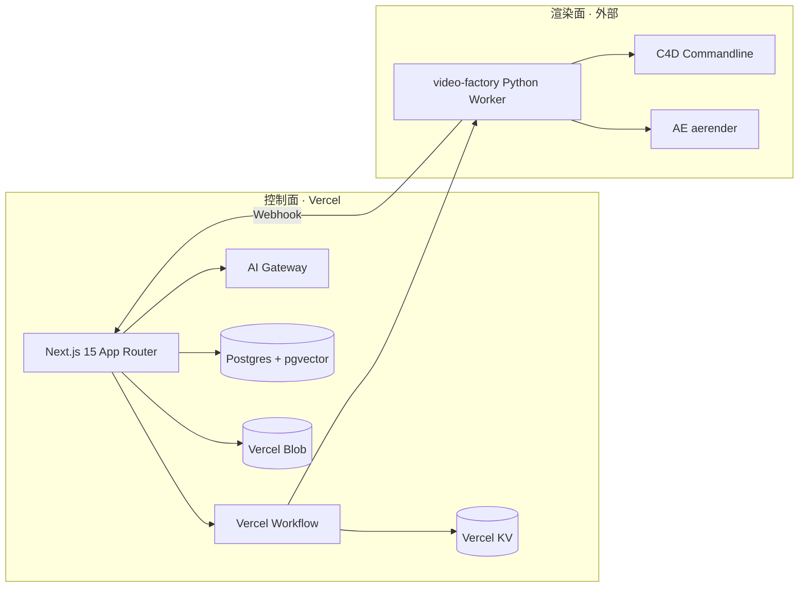

> ⚠️ **业务架构与映射表见 [MASTER_PLAN.md](./MASTER_PLAN.md)**。本文为 Vercel 企业栈技术细节.

> **文档索引**：本文件为分册说明；**唯一总览**见 [MASTER_PLAN.md](./MASTER_PLAN.md)（八层架构、排期、商业化与 API 清单）。
# AI 电商种草视频 SaaS — 技术栈说明

> **版本**：v1.0（Vercel 企业级云原生）
> **定位**：多租户 B2B 种草视频生成与编排平台
> **原则**：控制面在 Vercel，渲染面在外部 Worker；Webhook + 队列解耦

---

## 1. 架构总览

| 平面 | 职责 | 运行环境 |
|------|------|----------|
| **控制面（Control Plane）** | Dashboard、API、AI 编排、鉴权、任务调度、Webhook 接收 | Vercel（Next.js 15） |
| **数据面（Data Plane）** | 关系数据、向量检索、对象存储、缓存队列 | Vercel Postgres / Neon、KV、Blob |
| **渲染面（Render Plane）** | 视频合成、C4D/AE 批渲染、FFmpeg 重编码 | Railway / Fly.io / 本地 i9 渲染节点 |

**不在 Vercel 上运行**：长耗时视频管线、C4D 无头渲染、AE aerender、大规模 FFmpeg — 全部通过队列下发至外部 Worker，完成后 HTTP Webhook 回写任务状态。

---

## 2. 前端 / 全栈

| 组件 | 选型 | 说明 |
|------|------|------|
| 框架 | **Next.js 15 App Router** | Vercel 原生部署；Server/Client 组件边界清晰 |
| UI 生成 | **v0.dev** | Dashboard、表单、数据表格的快速迭代与 design token 对齐 |
| 组件库 | **shadcn/ui + Tailwind CSS** | 可访问性、主题、与 v0 输出一致 |
| 渲染模型 | **React Server Components (RSC)** | 默认服务端渲染；敏感逻辑与数据获取不进入客户端 bundle |
| 数据变更 | **Server Actions** | 表单提交、任务创建、租户配置变更 |
| API | **Route Handlers** | Webhook、第三方回调、流式 AI 响应 |

**推荐目录结构（示意）**

- `app/(dashboard)/` — 商家与运营台
- `app/api/` — Route Handlers（含 `/api/webhooks/render`）
- `components/ui/` — shadcn 组件
- `lib/ai/` — AI SDK 封装与 Gateway 配置

---

## 3. AI 层

### 3.1 Vercel AI SDK（`ai` 包）

| API | 用途 |
|-----|------|
| `useChat` | 商家侧对话式脚本/创意助手（Client） |
| `useObject` | 流式结构化 UI（分镜、商品卖点 JSON） |
| `streamText` | 长文案、口播稿流式生成（Route Handler / Server Action） |
| `generateObject` | 一次性结构化输出（分镜 YAML、质检规则） |
| **v6 注意** | 结构化输出推荐 `generateText` + `Output.object()` 替代部分 `generateObject` 用法，与 Gateway 模型能力对齐 |

### 3.2 Vercel AI Gateway

- **单一端点** 路由 OpenAI、Anthropic、DeepSeek、Google 等，统一鉴权、限流与可观测性
- 应用内通过 `baseURL` + Gateway API Key（或 Vercel OIDC 集成）调用，避免在代码中散落多厂商 Key
- 按环境（Production / Preview）在 Vercel 项目设置中配置不同 Gateway 路由策略

### 3.3 模型与 Provider 配置表

| 场景 | 推荐模型 | Provider（经 Gateway） | 备注 |
|------|----------|------------------------|------|
| 口播/种草文案 | DeepSeek V3 / GPT-4o mini | DeepSeek / OpenAI | 成本与中文表现平衡 |
| 分镜与结构化脚本 | Claude Sonnet / GPT-4o | Anthropic / OpenAI | `Output.object` 约束 schema |
| 多模态商品理解 | Gemini 1.5 Pro | Google | 商品图 + 描述联合理解 |
| Embedding | text-embedding-3-small 或 Gateway 等价物 | OpenAI / 托管 embedding | 与 pgvector 维度一致 |
| 运营质检摘要 | Claude Haiku / 小模型 | Anthropic | 低成本批量 |

环境变量示例（名称示意，勿提交真实密钥）：`AI_GATEWAY_URL`、`AI_GATEWAY_API_KEY`、各 Provider 在 Gateway 控制台侧绑定。

---

## 4. 后端 / 编排

| 能力 | 首选 | 备选 |
|------|------|------|
| 同步 API | Next.js **Route Handlers** | — |
| 突变与表单 | **Server Actions** | — |
| 长任务编排 | **Vercel Workflow**（首选） | Inngest、Trigger.dev |
| 重计算 / 视频 | **Python Worker**（Railway / Fly.io） | 自建 K8s Job |

**编排模式**

1. 用户提交「生成种草视频」→ Server Action 写入 Postgres 任务 + KV 队列
2. Workflow 步骤：AI 生成分镜 → 校验 → 推送 `render_job` 至外部 Worker
3. Worker 完成后 `POST /api/webhooks/render` → 更新 Blob URL、触发 L6 质检 Workflow
4. 失败重试与死信：KV 记录 attempt，Workflow 补偿或人工 ops 介入

---

## 5. 数据层（L8）

| 存储 | 用途 |
|------|------|
| **Vercel Postgres** 或 **Neon** | 租户、订单、任务、分镜版本、RBAC |
| **Vercel KV / Redis** | 渲染队列、幂等键、速率限制、短期任务状态 |
| **Vercel Blob** | 成片、中间素材、缩略图、导出包 |
| **Vercel Analytics** + **ECharts** | 产品埋点 + 运营大屏（转化率、渲染耗时、失败率） |

**迁移与分支**：Preview 环境使用 Neon branch 或独立 Postgres 实例，避免 PR 污染生产数据。

---

## 6. RAG 与 IntelliSafe（智能安全）

| 组件 | 选型 |
|------|------|
| 向量库 | **pgvector**（与 Postgres 同库）或 Pinecone / **Upstash Vector** |
| 嵌入 | AI SDK `embed` / `embedMany` + Gateway 路由的 embedding 模型 |
| 知识源 | 品牌调性指南、违禁词库、平台审核规则、历史高分脚本 |

**典型流程**

1. 文档切块 → `embedMany` → 写入向量表（带 `tenant_id`）
2. 生成前 RAG 检索 → 注入 system prompt
3. 生成后规则 + 小模型二次审核（IntelliSafe），不通过则 Workflow 回滚至人工审核节点

---

## 7. 渲染管线（外部）

| 组件 | 角色 |
|------|------|
| **video-factory**（Python Worker） | 编排 YAML 分镜、调用下游渲染器、上传 Blob、回调 Vercel |
| **C4D Commandline** | 3D 产品场景、模板化镜头（i9 或专用渲染节点） |
| **AE aerender** | 动效包装、字幕轨、品牌模板合成 |
| **Webhook** | `Authorization` + 签名验证；payload 含 `job_id`、`status`、`artifact_urls` |

**约束**：单 Job 超时、并发上限在 Worker 侧配置；Vercel 仅保存元数据与 URL，不持有大文件内存。

---

## 8. 鉴权与多租户

| 方案 | 适用 |
|------|------|
| **NextAuth.js v5**（Auth.js） | 自建 IdP、Credentials/OAuth、与 Postgres 用户表深度集成 |
| **Clerk Enterprise** | 快速上线 SSO、组织（Organization）即租户、合规需求 |

**RBAC 角色（示意）**

| 角色 | 权限 |
|------|------|
| `merchant` | 本租户商品、任务、成片下载 |
| `ops` | 跨租户任务监控、重试、质检队列 |
| `admin` | 租户开通、Gateway 配额、系统配置 |

所有 API 与 Server Actions 必须校验 `tenant_id`，向量与 Blob 路径带租户前缀。

---

## 9. 部署与运维

生产与预览环境的一键部署、环境变量（含 AI Gateway OIDC）、外部 Worker 与 PR Preview 流程见 **[DEPLOY.md](./DEPLOY.md)**。

---

## 10. 技术决策摘要

- **云原生控制面**：Next.js 15 on Vercel，AI Gateway 统一模型入口，Workflow 负责可靠编排
- **渲染面外置**：视频/C4D/AE 不进 Serverless 函数，避免超时与冷启动
- **Webhook + 队列**：异步边界清晰，可水平扩展 Worker
- **专业工程取向**：可观测（Analytics + 结构化日志）、多租户 RBAC、RAG + 生成后审核，面向企业客户交付

---

*文档由 `scripts/write_remaining_docs.py` 生成，与仓库 `PROJECT_PLAN.md` 架构分层一致。*
